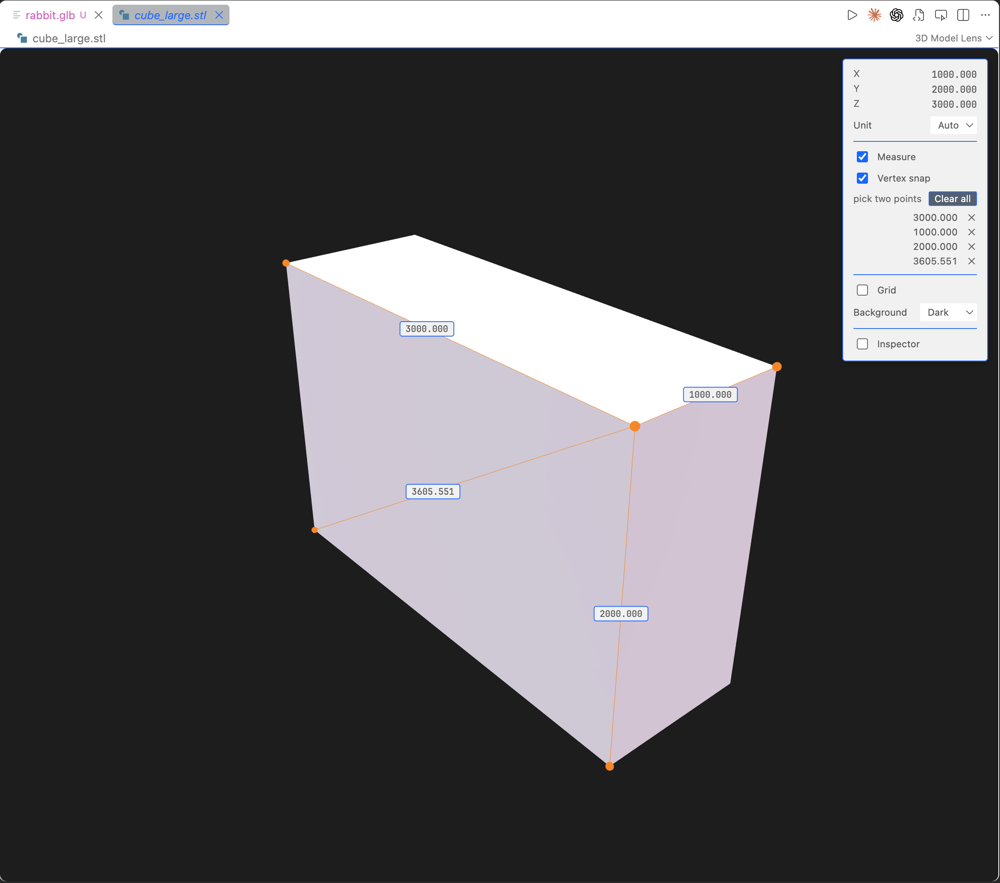
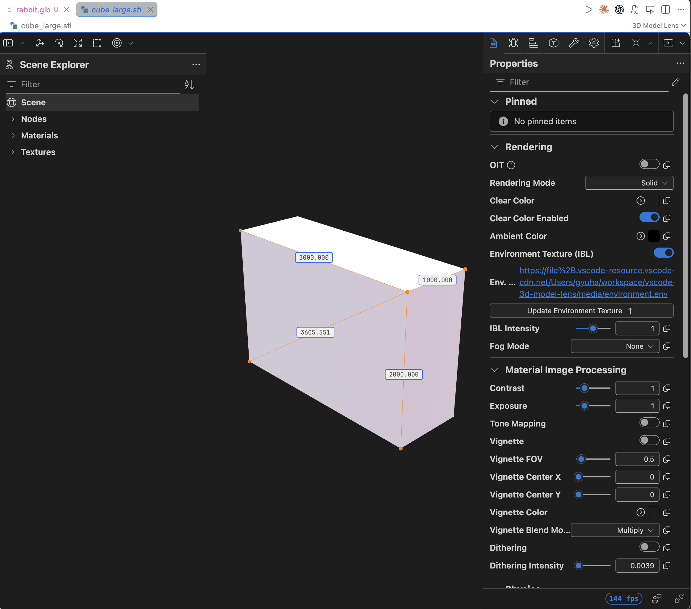

# 3D Model Lens

A VS Code extension for viewing 3D models and **reading their size honestly**. Built on Babylon.js.

Open a `.gltf`, `.glb` or `.stl` file and the viewer opens in place — bounding box up front, distances on
demand, and nothing invented along the way.

## Supported formats

| Format | Notes |
|---|---|
| `.gltf` | Resolves external `.bin` and texture references |
| `.glb` | Binary container |
| `.stl` | ASCII / binary |

Click a file and the viewer opens. To see it as text, use `Reopen Editor With… → Text Editor`.

## Dimensions

Opening a file immediately shows the bounding box `X / Y / Z` size in the viewer panel.

Pick the unit from the panel dropdown. The default `Auto` shows **meters for glTF/GLB** (the spec defines
it that way) and **plain numbers with no label for STL** — the STL format has no unit field, so we cannot
claim it is millimeters. Your chosen unit is **remembered per file**, so reopening the same STL restores it.
The unit changes only the displayed label; no geometry is transformed ("1 model unit = 1 of this unit").

The box is never called "width × height × depth". It is labeled `X / Y / Z` only, because the glTF loader's
coordinate-system conversion and the Z-up convention in CAD-origin files would make those names wrong half
the time.

## Measurement

Turn on measure mode with the `Measure` checkbox in the viewer panel (or the measure icon in the editor
title bar, or `3D Model Lens: Toggle Measure Mode` from the command palette — all three stay in sync), then
**pick two points** on the surface to create one distance. You can still **drag to orbit** while in measure
mode — movement past a threshold does not place a measurement point.

- **Vertex snap** (on by default): snaps to the nearest of the three vertices of the triangle you clicked.
  This is what you need to measure corner and edge dimensions accurately. To see where the vertices are,
  open the Babylon Inspector and turn on `Wireframe` on the model's material — note that the Inspector
  renders continuously, so the idle render gate stays off while it is open.
- Measurement lines and markers are drawn **through the model** so they stay visible. Marker size scales
  with model size, so they are visible on both very small and very large models.
- Measurements accumulate in a list. Click an entry to select it, `✕` to remove one, `Clear all` to remove
  them all.
- Changing the unit also refreshes the labels of measurements you already made.
- **Measurements are session-scoped** — closing the tab discards them. They are not saved to a file.
- You can measure while the Inspector is open.

Angles, surface area, and volume are not supported — see [deliberate omissions](#what-this-extension-does-not-do).

## Inspector

Toggle the Babylon Inspector from the viewer panel checkbox, the editor title bar icon, or the command
palette (`3D Model Lens: Toggle Inspector`). It shows the node hierarchy, materials, textures, and
rendering state — and your measurements stay put while you use it.

The Inspector is heavy (React + FluentUI), so it lives in a separate chunk that **loads only when you turn
it on** — viewing a model alone neither downloads nor parses it.

Because this is a read-only viewer, **node and GUI editors are not supported**. Pressing those buttons
inside the Inspector says so (this also removed roughly 10 MB and several external CDN dependencies).

## Settings

| Setting | Default | Description |
|---|---|---|
| `modelLens.background` | `theme` | Viewer background mode. `theme` follows the VS Code editor background color; `light` (`#ffffff`) and `dark` (`#1f1f1f`) pin it regardless of the theme. Changing it from the viewer panel saves it here. |
| `modelLens.grid` | `true` | Show the ground grid in the viewer. Toggling it from the viewer panel saves it here and applies to every open viewer immediately. |
| `modelLens.inspectorOnStart` | `false` | Start with the Inspector open when a model is opened. |
| `modelLens.unit` | `auto` | **Initial** unit for dimensions and measurements. `auto` means `m` for glTF/GLB and no label for STL. Changeable per file from the viewer panel, and that choice is remembered. |
| `modelLens.decimals` | `3` | Number of decimal places displayed (0–10). |

## Resources

A 3D viewer burns GPU even while sitting still, so two things prevent that.

- **Rendering stops when idle.** If nothing has changed among the camera, measurements, and display
  settings, no frame is drawn. While you look at a stationary model, GPU work is zero. Any interaction
  redraws immediately. While the Inspector is open we render continuously, because its fps counter and
  gizmos depend on the render loop.
- **Background tabs are not kept alive.** We let VS Code destroy the webview of a hidden tab (we do not use
  `retainContextWhenHidden`), so WebGL contexts do not pile up with the number of open tabs. The only live
  3D context is the **viewer you can see**.

The cost is a reload delay when you switch back to a tab. In exchange, **measurements, camera position,
display toggles, and measure mode are all restored**, so your work is not interrupted (restarting VS Code
clears them).

Whether clicking model files in a row reuses a single tab is decided by VS Code's
`workbench.editor.enablePreview` setting (default `true` — a single click reuses the tab).

## No external network access

Model loading, environment lighting (IBL), and the Inspector all use only local resources bundled with the
extension. The webview CSP structurally blocks outbound requests with `default-src 'none'`, and
`npm run check:bundle` watches for new external dependencies creeping into the build output.

## What this extension does not do

Each omission is deliberate, and each has a reason. (click to expand)

- **No OBJ / OFF / PLY / PCD / XYZ.** They fall outside Babylon's built-in loaders, and point clouds have a fundamentally different measurement UX.
- **No angle measurement.** Reusing the picking, snapping, and label infrastructure from distance measurement makes this cheap to add later, so it is left as follow-up work.
- **Measurements are not saved to a file.** Designing a sidecar file format is a separate piece of work.
- **No volume / surface area.** On non-watertight meshes, volume produces a meaningless number. Showing a plausible wrong answer is worse than having no feature at all.
- **The bounding box is never called "width × height × depth".** It is labeled `X / Y / Z` only. Because of the glTF loader's coordinate-system conversion and the Z-up convention in CAD-origin files, those names would be wrong half the time.
- **No Draco / meshopt compression, no KTX2 / Basis textures.** These fetch their decoders from external CDNs, which the webview CSP blocks. By not registering them, we report a clear "unsupported extension" instead of failing silently.
- **STL axes are used exactly as the file states them.** Babylon swaps STL's Y and Z by default (STL is Z-up, Babylon is Y-up), but then the file says `Z=30` while the viewer displays `Y=30`. In a measurement tool that is a lie, so we accept the cost of Z-up CAD files appearing to lie on their side.
- **Textures referenced through `../`.** The webview's allowed resource roots are limited to the extension directory, the workspace folder, and the model file's own directory. That limit is better than opening the filesystem root.

## Contributing

Build commands, the three-layer verification strategy, and how to run the extension locally are in
[CONTRIBUTING.md](./CONTRIBUTING.md).

## Changelog

See [CHANGELOG.md](./CHANGELOG.md).

## License

MIT. See [NOTICE](./NOTICE) for third-party attributions.
